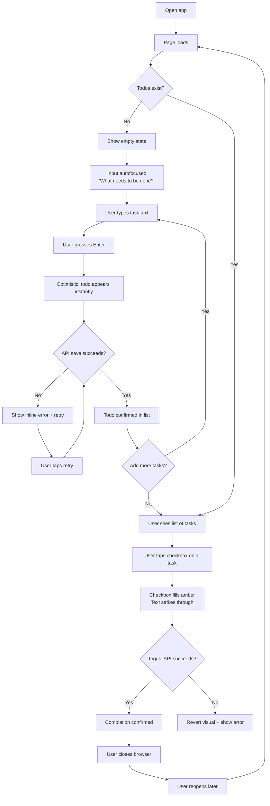
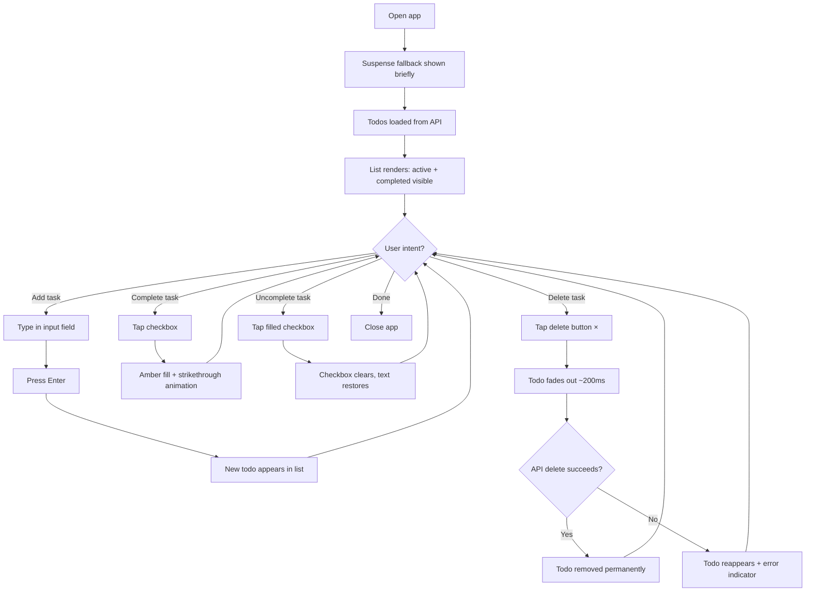
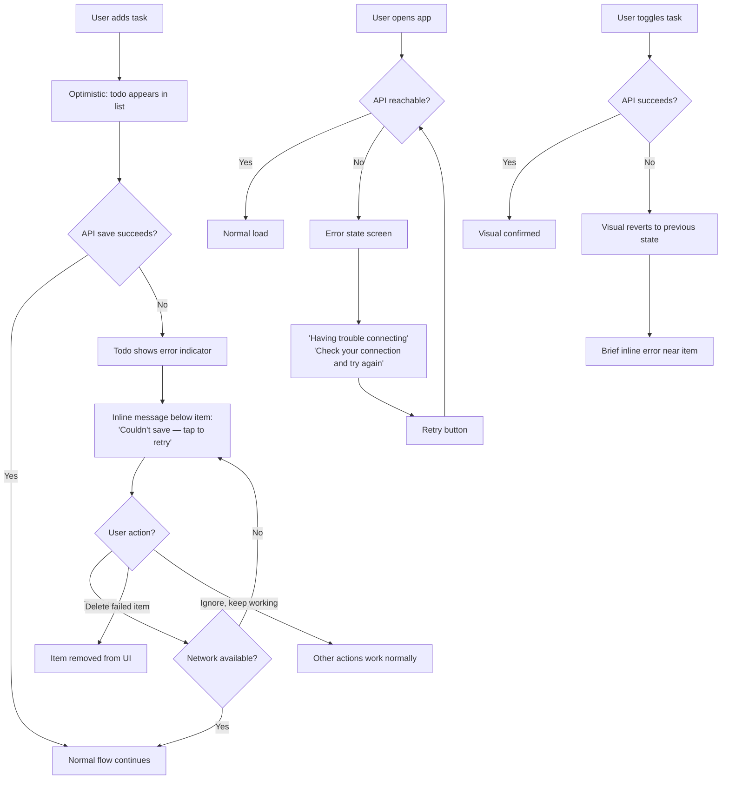

---
stepsCompleted:
  - 1
  - 2
  - 3
  - 4
  - 5
  - 6
  - 7
  - 8
  - 9
  - 10
inputDocuments:
  - prd.md
  - architecture.md
---

# UX Design Specification bmad-todo

**Author:** Hizo
**Date:** 2026-03-16

---

## Executive Summary

### Project Vision

bmad-todo is a personal task management app where deliberate simplicity is the design principle, not a shortcut. Every interaction is immediate, every state is handled with polish, and the scope is intentionally constrained to deliver a product that feels finished — not minimal. The UX goal is to create an experience where a user never needs instructions, never encounters a broken state, and never doubts whether their data was saved.

### Target Users

Primary user: an individual (like "Alex," a freelance designer) who needs a reliable, zero-onboarding task scratchpad. Moderately tech-savvy, expects modern app quality, uses the tool across desktop and mobile throughout the day. Values speed, clarity, and reliability over feature richness.

### Key Design Challenges

1. **Making simple feel polished, not bare** — With only four core actions, the UI has nowhere to hide. Every detail in spacing, typography, color, and motion contributes to perceived quality.
2. **State communication without clutter** — Empty, loading, and error states must feel intentional and helpful without adding visual noise to a clean interface.
3. **Responsive touch/click balance** — Todo items need to be easily tappable on mobile while maintaining appropriate density on desktop.

### Design Opportunities

1. **Micro-interactions as personality** — Each core action (add, complete, delete) is a chance for satisfying, character-defining animations.
2. **Empty state as onboarding** — The first-time experience is the entire onboarding — an opportunity to set tone and build immediate trust.
3. **Error states as trust-builders** — Clear, friendly error communication on flaky networks transforms frustration into confidence.

## Core User Experience

### Defining Experience

The core experience of bmad-todo is the **capture → complete loop**: type a task, hit enter, see it appear instantly, check it off when done. This tight loop is the product's heartbeat. Everything else — delete, error recovery, persistence — exists to protect and enhance this loop. The app should feel like an extension of the user's thought process, not a tool they have to operate.

### Platform Strategy

- **Web SPA** — responsive, mobile-first CSS serving both phone and desktop viewports
- **Input modes** — touch (mobile) and mouse/keyboard (desktop) with equal consideration
- **No offline support** in v1 — standard HTTP request-response; architecture doesn't preclude adding it later
- **No native capabilities needed** — browser-only, modern evergreen browsers
- **Keyboard-first on desktop** — enter to submit, tab to navigate, no mouse required for core flows

### Effortless Interactions

- **Task capture** — zero friction from thought to saved task. A single text input, always visible, always ready. Type and hit enter. No modals, no extra fields, no categories to choose.
- **Completion toggle** — one tap/click to mark done. Visual change is immediate and unambiguous. Reversible with the same gesture.
- **Delete** — clear affordance, no excessive confirmation for a low-stakes action. One action removes the todo.
- **Page load** — returning users see their list instantly. No login screen, no splash, no loading spinner that lingers.

### Critical Success Moments

1. **First task added** — the user types, hits enter, and the todo appears in the list. Instant. No page reload, no delay. This is the "this just works" moment that earns initial trust.
2. **First task completed** — the checkbox/toggle produces a satisfying visual shift. The user sees what's done vs. what's left at a glance. This is the payoff moment.
3. **Return visit — data persisted** — the user closes the browser, comes back later, and everything is exactly as they left it. Trust is cemented.
4. **Error handled gracefully** — on a flaky connection, the app tells the user what happened and what to do. Trust is reinforced rather than broken.

### Experience Principles

1. **Instant by default** — every action produces immediate visual feedback. If the network is involved, optimistic UI or sub-100ms perceived response. The user should never wait.
2. **Obvious over clever** — task status, available actions, and current state should be understood at a glance. No hidden gestures, no ambiguous icons, no mystery states.
3. **Quiet confidence** — the app communicates reliability through consistency and graceful error handling, not through flashy features. It earns trust by never breaking.
4. **Nothing extra** — every element on screen has a purpose. No decorative chrome, no empty features, no UI that exists "just in case." Simplicity is the product.

## Desired Emotional Response

### Primary Emotional Goals

- **Calm control** — the user feels in charge of their tasks, not managed by the tool. The app is a quiet servant, not an anxious assistant.
- **Effortless competence** — using the app makes the user feel capable and efficient, like they're getting things done without friction.
- **Trust** — the user never wonders "did that save?" or "what just happened?" Reliability creates an emotional baseline of confidence.

### Emotional Journey Mapping

| Moment | Desired Feeling |
|--------|----------------|
| First visit (empty state) | Welcomed, not overwhelmed. Curious, not confused. |
| First task added | Satisfaction — "that was easy." Instant payoff. |
| Checking off a task | Small burst of accomplishment. The visual reward matters. |
| Returning to a persisted list | Relief and trust — "it's all here." |
| Error on flaky network | Informed, not alarmed. "I know what happened and I can fix it." |
| Deleting a stale task | Lightness — cleaning up feels good, not scary. |

### Micro-Emotions

- **Confidence over confusion** — every state is self-explanatory
- **Trust over skepticism** — data persistence and error handling eliminate doubt
- **Accomplishment over frustration** — completion feels rewarding, never tedious
- **Calm over anxiety** — no destructive actions without clear affordance, no data loss fears

### Design Implications

- **Calm control** → clean layout with generous whitespace, muted color palette, no competing visual elements
- **Effortless competence** → instant feedback on every action, minimal steps to accomplish anything, keyboard shortcuts on desktop
- **Trust** → visible confirmation of saves, clear error messages with recovery paths, consistent behavior across sessions
- **Accomplishment** → satisfying completion animation, visual distinction between active and done, a sense of progress

### Emotional Design Principles

1. **Reward the small wins** — every task completion deserves a moment of visual satisfaction, however subtle
2. **Never leave the user wondering** — every action produces clear feedback; every state is visually distinct
3. **Make errors feel recoverable** — when things go wrong, the tone is helpful and calm, never alarming
4. **Respect attention** — the app stays out of the way until needed; no notifications, badges, or attention-grabbing elements in v1

## UX Pattern Analysis & Inspiration

### Inspiring Products Analysis

**Apple Reminders** — Nails the "just type and go" capture experience. Clean list view with obvious completion toggles. Elegant empty states that don't feel broken. Subtle animations on task completion. Relevant because it proves a system-level todo app can feel polished without complexity.

**Things 3 (Cultured Code)** — The gold standard for "polished simplicity" in task apps. Completion animation is genuinely satisfying — a brief moment of reward. Generous whitespace, excellent typography hierarchy. Every state feels intentional and crafted. Relevant because it demonstrates that minimalism can feel premium, not cheap.

**Todoist** — Lightning-fast task capture with keyboard shortcuts. Inline error handling — errors appear near the action, not in a modal. Quick add is frictionless and always accessible. Relevant because it shows how keyboard-first design serves power users without alienating casual ones.

### Transferable UX Patterns

**Interaction Patterns:**
- **Always-visible input** (Todoist, Reminders) — the add-task input is permanently visible, not behind a button. Reduces friction to zero for the most frequent action.
- **Single-gesture completion** (Things 3, Reminders) — one tap/click to toggle done, with immediate visual feedback. No intermediate states.
- **Inline error feedback** (Todoist) — errors appear contextually near the failed action rather than in disruptive modals or toasts at screen edges.

**Visual Patterns:**
- **Generous whitespace as design element** (Things 3) — breathing room between items conveys calm and quality, supports our "calm control" emotional goal.
- **Typography hierarchy over UI chrome** (Things 3) — using font weight, size, and color to create structure instead of borders, dividers, and boxes.
- **Completion strikethrough + opacity shift** (Todoist, Reminders) — completed tasks become visually subdued but remain visible, communicating status at a glance.

**State Patterns:**
- **Friendly empty states** (Reminders) — illustration or gentle prompt rather than a blank void. Sets the tone for the entire experience.
- **Skeleton/placeholder loading** — brief placeholder content rather than spinners, preserving layout stability during load.

### Anti-Patterns to Avoid

- **Complexity creep** (Notion) — too many options on every element, hover menus everywhere. Conflicts with our "nothing extra" principle.
- **Ambiguous navigation** (Microsoft To Do) — multiple competing organizational concepts create cognitive overhead. We have one list — keep it that way.
- **Invisible affordances** (Google Tasks) — actions that require discovery or guessing. Conflicts with "obvious over clever."
- **Modal delete confirmations** — unnecessary friction for a low-stakes action in a personal todo app. A brief undo option is friendlier than a "Are you sure?" dialog.
- **Toast notification overload** — success toasts for every action creates noise. Reserve prominent feedback for errors and recovery; let success be communicated through the UI state itself.

### Design Inspiration Strategy

**Adopt directly:**
- Always-visible task input (no "+" button to reveal it)
- Single-gesture completion toggle with visual state change
- Typography-driven hierarchy over UI chrome
- Friendly, purposeful empty state

**Adapt for bmad-todo:**
- Things 3's completion animation — adapt to web (CSS transitions), keep it subtle but satisfying
- Todoist's inline error handling — simplify for our single-list context, show errors directly in the list area
- Skeleton loading — keep minimal since our data set is small; a brief fade-in may suffice

**Explicitly avoid:**
- Feature-rich hover menus or context menus
- Multiple view modes or organizational schemes
- Modal dialogs for any standard action
- Success toast notifications for routine operations

## Design System Foundation

### Design System Choice

**shadcn/ui + Tailwind CSS v4** — a themeable, accessible component system that gives us proven primitives with full visual control. Components are copied into the project (not imported from a library), so we own every line and ship only what we use.

### Rationale for Selection

- **Already specified in architecture** — aligns with the technical decisions in the architecture document, ensuring no friction between UX and engineering
- **Accessibility built-in** — Radix UI primitives provide WCAG AA keyboard navigation, focus management, and ARIA attributes out of the box
- **Full visual control** — CSS variables for theming + Tailwind utility classes let us define a unique visual identity without fighting the framework
- **Performance** — copy-paste model means zero unused library code; only the components we need are in the bundle
- **Solo developer fit** — no dependency lock-in, styling co-located with components, minimal configuration overhead
- **Simplicity alignment** — the component set is minimal by nature, supporting our "nothing extra" principle

### Implementation Approach

**shadcn/ui primitives to use:**
- `Button` — delete action, retry on error states
- `Input` — task text entry in the add form
- `Checkbox` — completion toggle on todo items
- `Card` — container for todo items or list wrapper (evaluate during implementation)

**Custom components to build:**
- `TodoItem` — composed from shadcn primitives (Checkbox, Button) with custom layout and completion animation
- `TodoList` — list container managing item rendering and empty state switching
- `AddTodoForm` — Input + submit behavior, always visible at top
- `EmptyState` — unique to our brand voice and emotional goals
- `ErrorState` — specific to our error recovery UX patterns
- `LoadingState` — Suspense fallback, minimal and layout-stable

### Customization Strategy

- **Design tokens via CSS variables** — colors, spacing, border radius, and typography defined as CSS custom properties, overriding shadcn defaults
- **Tailwind configuration** — extend the default theme with our specific palette, font stack, and spacing scale
- **Component-level customization** — since shadcn components are owned source code, modify directly for our needs (e.g., custom Checkbox animation for completion)
- **No theme switching in v1** — single light theme; architecture supports adding dark mode later via CSS variable swap

## Defining Experience

### Core Interaction

**"Type it, check it off, forget the rest."**

The defining interaction is the capture → complete loop — the product's entire value delivered in two gestures. Everything else (delete, error recovery, persistence) exists to protect this loop. The UX mirrors a paper checklist — write it down, cross it off — but faster and persistent.

### User Mental Model

Users bring a paper-checklist mental model: write it down, cross it off, throw away what's stale. They don't think in CRUD operations — they think in tasks and completion. The interface must match this simplicity:

- No list/project/category selection before capturing a task
- No bureaucratic confirmation flows for completion or deletion
- No distinction between "save" and "done typing" — Enter means saved

**Where existing solutions break this model:**
- Requiring organizational decisions before capture (categories, projects, priorities)
- Making completion feel heavy (confirm dialogs, blocking undo prompts)
- Making delete feel dangerous rather than lightweight

### Success Criteria

- User can add their first todo within 3 seconds of page load, with no instruction
- Every action (add, complete, delete) produces visible feedback in under 100ms
- A returning user sees their exact prior state within 2 seconds of opening the app
- No action requires more than one gesture (one tap, one keypress) beyond text entry
- Error states are self-explanatory — user knows what happened and what to do without reading documentation

### Novel UX Patterns

No novel patterns required — checkboxes, text inputs, lists, and delete buttons are universal. The opportunity is **execution quality within established patterns**, not invention:

- Established: always-visible input, checkbox toggle, list view, delete action
- Our twist: micro-animations on completion that create a moment of satisfaction, inline error recovery that feels conversational rather than alarming, and empty states that set emotional tone

### Experience Mechanics

**1. Capture (Add Todo):**
- **Initiation:** Input field always visible at top, autofocused on page load. Placeholder: "What needs to be done?"
- **Interaction:** Type task text → press Enter (keyboard) or tap submit (mobile)
- **Feedback:** New todo appears in the list instantly (optimistic UI). Input clears, ready for next task.
- **Error path:** Todo appears with error indicator. Inline message: "Couldn't save — tap to retry."

**2. Complete (Toggle):**
- **Initiation:** Checkbox visible on every todo item, left-aligned
- **Interaction:** Single click/tap on checkbox
- **Feedback:** Checkbox fills with animation. Text gets strikethrough + reduced opacity (~200ms CSS transition). Screen reader announces "Task completed" via aria-live region.
- **Reversal:** Same gesture to uncomplete. Visual restores smoothly.

**3. Delete:**
- **Initiation:** Delete button/icon visible on each todo item, right-aligned
- **Interaction:** Single click/tap
- **Feedback:** Todo fades/slides out (~200ms). No confirmation modal. List reflows.
- **Error path:** Todo reappears with error indicator if network fails.

**4. Return (Load):**
- **Initiation:** User opens/refreshes the app
- **Feedback:** List appears quickly with Suspense fallback if needed. State is exactly as left.
- **Empty path:** If no todos exist, friendly empty state invites first task creation.

## Visual Design Foundation

### Color System

**Philosophy:** A neutral-dominant palette with a single accent color. The interface should feel like a well-designed notebook — clean, quiet, and focused on content rather than chrome.

**Primary Palette:**

| Role | Color | Value | Usage |
|------|-------|-------|-------|
| Background | White | `#FFFFFF` | Page background |
| Surface | Warm gray | `#F9FAFB` | Card/container backgrounds, subtle separation |
| Border | Light gray | `#E5E7EB` | Dividers, input borders, subtle structure |
| Text Primary | Near-black | `#111827` | Todo text, headings — high contrast, easy to read |
| Text Secondary | Medium gray | `#6B7280` | Placeholder text, timestamps, secondary info |
| Text Muted | Light gray | `#9CA3AF` | Completed todo text, disabled states |

**Accent & Semantic Colors:**

| Role | Color | Value | Usage |
|------|-------|-------|-------|
| Accent | Soft blue | `#3B82F6` | Focus rings, active input border, primary interactive elements |
| Success/Complete | Soft green | `#10B981` | Completion checkbox fill, success states |
| Error | Soft red | `#EF4444` | Error messages, failed action indicators |
| Error Background | Light red | `#FEF2F2` | Error state container background |

**Design Rationale:**
- Neutral-dominant supports "calm control" — no competing colors fight for attention
- Warm grays (not blue-tinted) feel approachable, not clinical
- Single accent (blue) for focus states keeps the palette unified
- Green for completion creates a natural "done = positive" association
- All color pairs meet WCAG AA contrast requirements (4.5:1+ for text)

### Typography System

**Font Stack:** System fonts — no custom web fonts to load. Instant rendering, zero FOIT/FOUT, and native feel on every platform.

```
font-family: -apple-system, BlinkMacSystemFont, "Segoe UI", Roboto, "Helvetica Neue", Arial, sans-serif;
```

**Type Scale (based on 1rem = 16px):**

| Element | Size | Weight | Line Height | Usage |
|---------|------|--------|-------------|-------|
| App title | 1.5rem (24px) | 700 | 1.3 | "bmad-todo" header |
| Todo text | 1rem (16px) | 400 | 1.5 | Active todo item text |
| Completed todo | 1rem (16px) | 400 | 1.5 | Strikethrough + muted color |
| Input text | 1rem (16px) | 400 | 1.5 | Task input field |
| Placeholder | 1rem (16px) | 400 | 1.5 | Input placeholder, secondary text |
| Error message | 0.875rem (14px) | 500 | 1.4 | Inline error text |
| Empty state heading | 1.125rem (18px) | 500 | 1.4 | Empty state prompt |
| Empty state body | 0.875rem (14px) | 400 | 1.5 | Empty state description |

**Typography Rationale:**
- System fonts = zero load time, native feel, supports "instant by default"
- Minimal scale (only 4 sizes) supports "nothing extra" — no complex hierarchy needed for a single-list app
- 16px base ensures readability and meets accessibility requirements
- Generous line height (1.5) for body text aids readability and creates breathing room

### Spacing & Layout Foundation

**Base Unit:** 4px grid system. All spacing is a multiple of 4px.

**Spacing Scale:**

| Token | Value | Usage |
|-------|-------|-------|
| `xs` | 4px | Tight gaps (icon-to-text within a button) |
| `sm` | 8px | Compact spacing (checkbox to todo text) |
| `md` | 12px | Standard padding (inside todo items) |
| `lg` | 16px | Section spacing (between todo items) |
| `xl` | 24px | Major spacing (input area to list, header to content) |
| `2xl` | 32px | Page-level margins |
| `3xl` | 48px | Empty state vertical centering buffer |

**Layout Structure:**
- **Max width:** 640px centered — a focused, readable column. Wide enough for comfortable text entry, narrow enough to feel intentional.
- **Horizontal padding:** 16px on mobile, 24px on larger screens
- **Todo item height:** Minimum 48px (touch target compliance) with 12px vertical padding
- **Input area:** Sticky or fixed at top, visually separated from the list below

**Layout Rationale:**
- 640px max-width creates a focused reading column — mirrors paper list width, prevents content from sprawling on wide screens
- Generous vertical spacing between items (16px) supports "calm control" emotional goal — Things 3 influence
- 48px minimum touch target ensures mobile usability and WCAG compliance
- 4px grid ensures mathematical consistency across all spacing decisions

### Accessibility Considerations

**Color Contrast Compliance:**
- Text Primary (#111827) on White (#FFFFFF): **15.4:1** — exceeds AA and AAA
- Text Secondary (#6B7280) on White (#FFFFFF): **5.0:1** — meets AA
- Text Muted (#9CA3AF) on White (#FFFFFF): **3.0:1** — meets AA for large text; used only for completed items where strikethrough provides additional visual cue
- Error (#EF4444) on Error Background (#FEF2F2): **4.6:1** — meets AA
- Accent (#3B82F6) on White (#FFFFFF): **4.6:1** — meets AA

**Focus Indicators:**
- All interactive elements get a visible 2px focus ring using the accent color
- Focus ring offset: 2px (doesn't overlap element borders)
- Tab order follows visual order: input → todo items (checkbox, delete) top-to-bottom

**Motion:**
- All animations respect `prefers-reduced-motion` — transitions collapse to instant state changes
- Default animation duration: 150-200ms (fast enough to feel instant, slow enough to register)

## Design Direction Decision

### Design Directions Explored

Six directions were explored via interactive HTML mockups (see `ux-design-directions.html`):
- **A: Clean Minimal** — flat items, thin dividers, Apple Reminders style
- **B: Card-Based** — individual cards with shadow on gray background
- **C: Borderless** — ultra-minimal, no dividers, hover-reveal actions
- **D: Warm & Friendly** — cream background, amber accent, notebook feel
- **E: Bold & Confident** — dark header, strong borders, professional
- **F: Soft & Airy** — rounded cards, pill input, indigo accent

### Chosen Direction

**Direction D: Warm & Friendly**

A warm, inviting interface with cream background (`#FFFBF5`), amber completion accent (`#F59E0B`), and a personal tone. The design evokes a well-loved notebook — approachable, comfortable, and distinctly personal.

**Key Visual Elements:**
- **Background:** Warm cream (`#FFFBF5`) instead of clinical white — feels lived-in, not sterile
- **Completion accent:** Amber/gold (`#F59E0B`) — warmer than green, feels like a reward rather than a status indicator
- **Text colors:** Warm stone tones (`#292524` primary, `#A8A29E` muted) — softer than pure gray
- **Input:** White field on cream background with subtle border — clear affordance with warmth
- **Checkboxes:** Round, with amber fill on completion
- **Tone:** Personal and friendly (e.g., "What's on your mind?" placeholder)

### Design Rationale

- **Emotional alignment:** Warm tones directly support "calm control" — the interface feels like a personal space, not a corporate tool
- **Differentiation:** Most todo apps use cold white/blue palettes. Warmth makes bmad-todo feel distinctive and memorable
- **Notebook metaphor:** Reinforces the paper-checklist mental model identified in the Defining Experience section
- **Accessibility preserved:** Warm stone tones maintain WCAG AA contrast ratios against the cream background
- **Simplicity intact:** The warmth adds personality without adding visual complexity — still "nothing extra"

### Implementation Approach

**Updated Color Tokens (replacing Visual Foundation defaults):**

| Role | Value | Replaces |
|------|-------|----------|
| Background | `#FFFBF5` | `#FFFFFF` |
| Surface | `#FFFFFF` | `#F9FAFB` |
| Border | `#E7E5E4` | `#E5E7EB` |
| Text Primary | `#292524` | `#111827` |
| Text Secondary | `#78716C` | `#6B7280` |
| Text Muted | `#A8A29E` | `#9CA3AF` |
| Accent (focus) | `#3B82F6` | unchanged |
| Success/Complete | `#F59E0B` (amber) | `#10B981` (green) |
| Error | `#EF4444` | unchanged |
| Error Background | `#FEF2F2` | unchanged |

**Tailwind Integration:**
- Extend Tailwind theme with `stone` color scale (already in Tailwind's palette) for warm grays
- Custom `cream` background color as CSS variable
- shadcn CSS variable overrides to shift the entire component library warm

**Typography & Spacing:** Unchanged from Visual Foundation — the warmth comes from color, not structure.

## User Journey Flows

### Journey 1: First-Time User — "Just Get Things Done"

**Entry:** User opens bmad-todo for the first time.

**Flow:**



**Key UX Moments:**
- **Empty state → first input:** Zero friction. Input is autofocused, placeholder invites action. No instructions needed.
- **First task appears:** Optimistic UI — todo shows in the list before the API confirms. Feels instant.
- **First completion:** Amber checkbox fill + strikethrough is the first "reward moment." Must feel satisfying.
- **Return visit:** Data is exactly as left. Trust is established.

### Journey 2: Returning User — Daily Task Management

**Entry:** User opens bmad-todo with existing tasks.

**Flow:**



**Key UX Moments:**
- **Fast load:** List appears quickly. Suspense fallback is brief or invisible on fast connections.
- **Multi-action session:** User flows naturally between add/complete/delete without mode switching. All actions available on every item.
- **Delete feels lightweight:** Fade-out animation, no confirmation dialog. If it fails, the item comes back — safe by default.
- **Session end:** No save button, no "are you sure?" — just close. Everything is already persisted.

### Journey 3: Error & Recovery — Flaky Connection

**Entry:** User is on unreliable network.

**Flow:**



**Key UX Moments:**
- **Failed save:** The todo still appears (optimistic), but with a clear error indicator. User isn't confused about what happened.
- **Retry is easy:** Single tap to retry. No navigating to a different screen or refreshing.
- **Failed toggle reverts:** If completion toggle fails, the visual snaps back. No false sense of progress.
- **Full offline:** If the server is unreachable on load, a full-screen friendly error state appears — not a blank page.
- **Tone:** Error messages are calm and helpful: "Couldn't save" not "Error 500."

### Journey Patterns

1. **Optimistic-then-confirm** — Every mutation shows immediate visual feedback, then confirms or reverts based on API response. The user never waits.
2. **Inline error recovery** — Errors appear near the action that failed, not in a global toast or modal. Recovery (retry) is always one tap away.
3. **Visual state = source of truth** — What the user sees always reflects the current known state. Failed actions revert visually.
4. **No mode switching** — All actions (add, complete, delete) are available at all times.

### Flow Optimization Principles

1. **Zero-step entry** — The app is immediately usable on load. No onboarding, no setup.
2. **Single-action operations** — Every user intent is one gesture. No multi-step workflows.
3. **Graceful degradation** — Network failures degrade the experience without breaking it.
4. **Consistent recovery** — All error states follow the same pattern: visual indicator + explanation + retry action.
